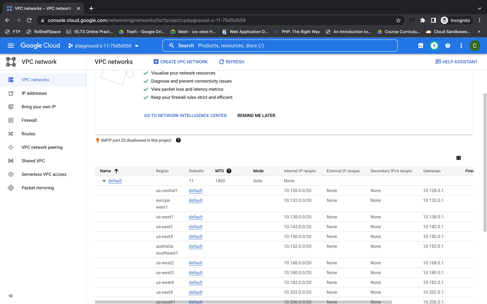
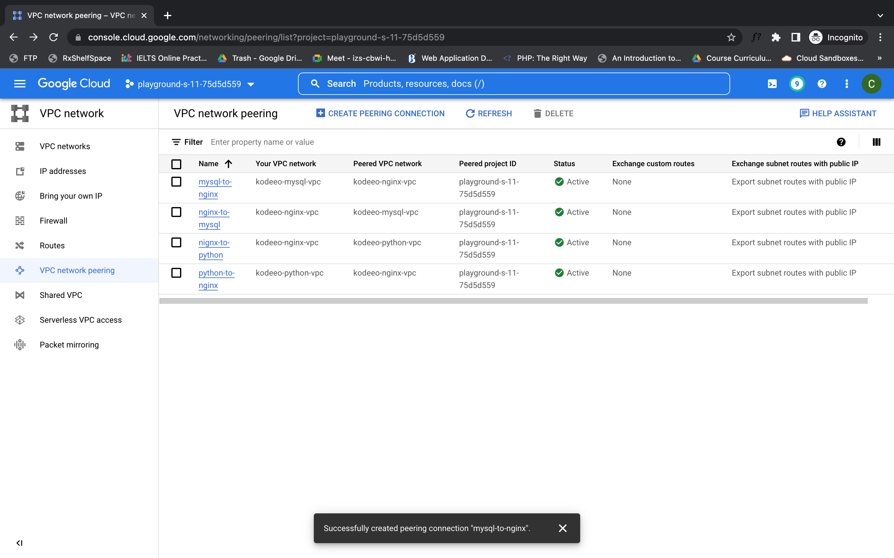
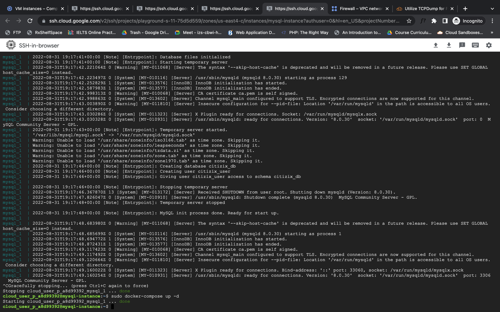
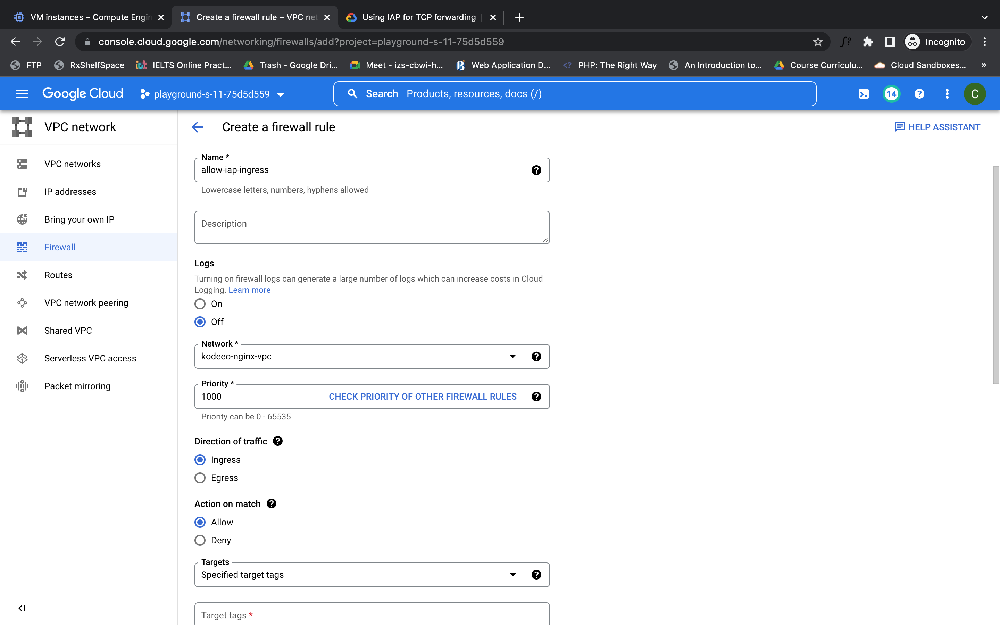

## Layer 4 load balancing using Nginx

In this tutorial, I am going to demonstrate Layer 4 load balancing using Nginx.
> What we will learn from here?

* VPC Creating



* VPC peering



* use of docker-compose
* Writing Nginx configuration as load balancer, and many more commands and uses of different tools

***

> Let's get started

Firstly, see the diagram of what we are going to do.

Our plan is to receive requests into Nginx 
if it will in port 80 then it will forward
it to the web server or our application server. 
If the application server want to access
the database it will send a request 
to Nginx on port `3306`. If Nginx received any 
request into the `3306` port, so it will forward the 
request to the MySQL server.
We will create 3 VPCs and also create a VM inside each. So each VPC has a VM and set IP range for each as below.

* VPC 1
    - VM: for Nginx
    - IP Range : 10.1.0.0/16


* VPC 2
    - VM: for Python / PHP
    - IP Range : 10.2.0.0/16

* VPC 3
    - VM: for MySQL
    - IP Range : 10.3.0.0/16


---
* The 1st VM will contain Nginx as a load balancer.
* The 2nd VM will contain a Web server (or Application Server), we can install PHP or python.
* The last one will contain MySQL as the Database server.

> Now create VPC peering from both sides as below

    VPC 1 to VPC 2
    VPC 2 to VPC 1

    VPC 1 to VPC 3
    VPC 3 to VPC 1

`After successful peering, it will show active status.`


> Let's create VM in each VPC Then access into each.


You can see 3 instances here. Click SSH on Nginx instance, 
it will open on a new tab but will not connect.
because SSH use `Google IAP` service to get access into VM. So we need
to allow traffic from `35.235.240.0/20` .
To fix the issue you need to create a firewall rule and allow `35.235.240.0/20` for all ingress traffic.

To know more visit here : [Google IAP](https://cloud.google.com/iap/docs/using-tcp-forwarding)

After retry by clicking again on SSH and hope you will get access into nginx instance.  
* Install Docker
* Install docker-compose
* Create docker-compose.yml file into it by `sudo nano docker-compose.yml`

Paste the following code

```Javascript
  version: "3"
  services:
  load-balance:
  image: nginx:stable-alpine
  container_name: nginx-proxy
  ports:
  - "80:80"
  volumes:
  - ./prod/nginx.conf:/etc/nginx/ngix.conf
```
Create nginx.conf file by `sudo nano nginx.conf`
Paste the following code

```Javascript
stream {
        upstream php-server {
        server 10.2.0.0:80; # private ip of php vpc
        }
        
        upstream mysql-db {
        server 10.3.0.0:3306; # private ip of mysql vpc
        }
        
    server {
        listen 80;
        proxy_connect_timeout 5s;
        proxy_timeout 5s;
        proxy_pass php-server;
        }
        
    server {
        listen 3306;
        proxy_connect_timeout 5s;
        proxy_timeout 5s;
        proxy_pass mysql-db;
        }
    }
```


Run the container by `docker-compose up -d` (-d for running into detached mode -i.e: in background)
> To check running container you can run `docker ps` (ps-process status)

* Do the same process for others. Create `docker-compose.yml` for mysql 



for the python also. (check the folder above)

The load balancer (nginx) is configured to listen on port `80` and forward to the Application service on another `VPC (10.2.0.2) port 3000`.
And port 3306 is forward to the database server instance's , i.e: `10.3.0.3 to 3306 port` that also on another VPC's .

> Test 01: Nginx to web server

To test, from menu go to `Compute engine > VM instance >`

* Click SSH on Nginx instance and get access into it. 
* Install telnet by running the command:`sudo apt install telnet`

* Then run command to check webapp connection `telnet 10.2.0.2 3000`
* before that create firewall rule to allow nginx IP `10.1.0.2` into webserver as ingress request


> Test 02: Nginx to MySQL

* create firewall rule to allow nginx IP `10.1.0.2` into MySQL as ingress request
* To check database connection `telnet 10.3.0.2 3306`

* To check database connection `telnet 10.0.0.2 3306`
> Final test: web server to mysql
* create firewall rule to allow MySQL IP `10.3.0.2` into Nginx as ingress request
* To check database connection `telnet 10.1.0.2 3306`
If everything is fine i.e: webserver send the request to the nginx and nginx forward the request to the mysql.


